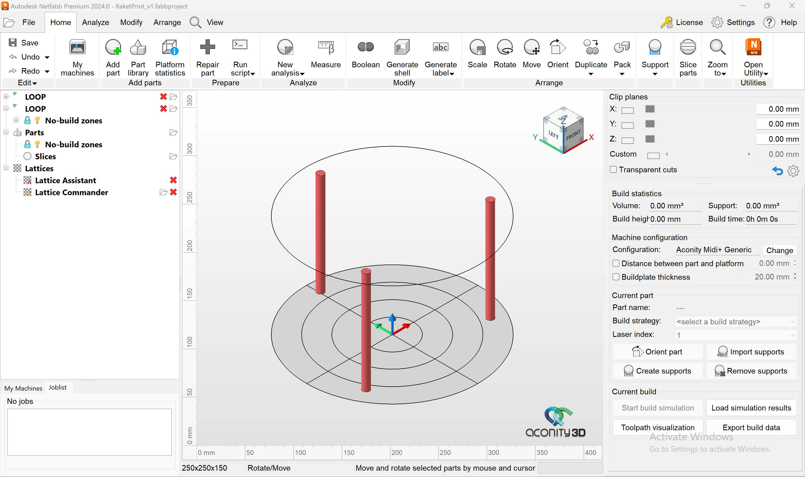

# Netfabb Gcode PostProcess Setup and Guide

## Setting up Netfabb

1. Download the two files (one XML and one 3MF) from the post-processors
GitHub page and save them in a known folder. E.g., …/Documents/NetfabbSetup
2. Add "Aconity Midi+" machine
3. Click the Pencil icon at the top right corner of the "My Machines" window.
4. Change the name to "LOOP” in the top textbox (the very top).
5. Check the "Customized machine" box at the bottom and change the Z-height to 150mm.
6. Click on "Save machine."
7. Right-click on the new "LOOP" machine on the left in the bar with the saved machines and select "Import
machine settings.”
8. Import the “Netfabb LOOP Settings.xml” that you saved previously.
9. Click on the Gear icon next to the Pencil icon.
10. Under **Custom machine: use custom no-build zones** choose the path to
the "LOOP ONE No Build Zone.3MF” that you saved previously.
11. Click on "Save"
12. Done

Result: Shows the three screw locations and moves the origin to the middle of
the build plate for easier alignment.

<h3 align="center">Netfabb LOOP build plate</h3>

## Using the post-processor

The post-processor is written in Matlab, and will in the foreseeable future be rewritten in Python and/or be integrated directly into the system software.

1. Run the script and select you CLI file. 
2. Select parameters per scan object. To select process parameters per scan object, they must be labeled according to the CLI standard.
3. Select machine paramters
4. Hit submit and wait for processing

The result is a folder and .zip folder containing the job file. Currently, each layer is exported in their own .txt and the next layer is explicitly loaded in the last line.
