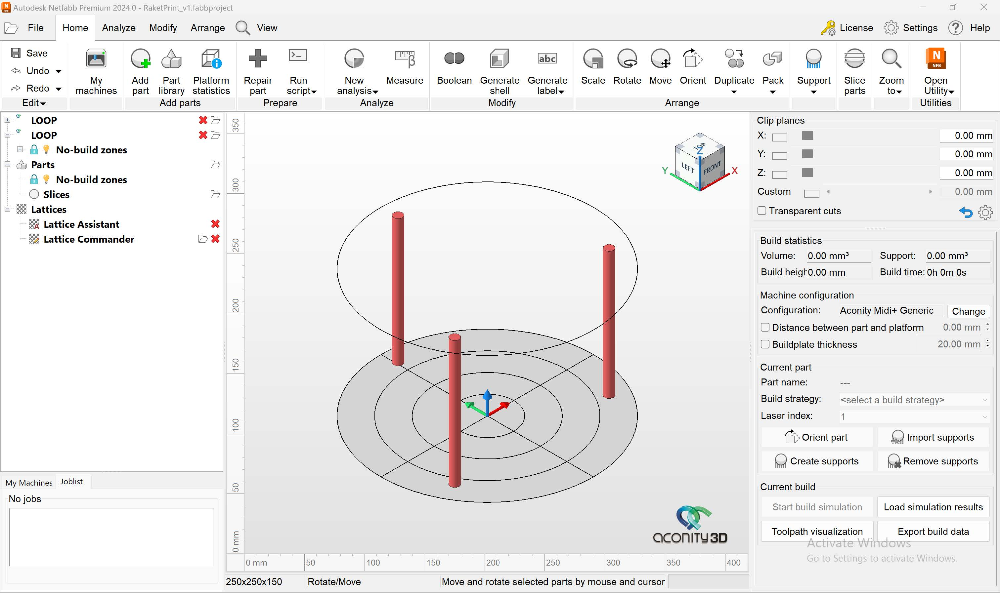

# Netfabb Gcode PostProcess Setup and Guide

## Setting up Netfabb

1. Download the two files (one XML and one 3MF) from the post-processors
GitHub page and save them in a known folder. E.g., …/Documents/NetfabbSetup
2. Add "Aconity Midi+" machine
3. Click the Pencil icon at the top right corner of the "My Machines" window.
4. Change the name to "LOOP” in the top textbox (the very top).
5. Check the "Customized machine" box at the bottom and change the Z-height to 150mm.
6. Click on "Save machine."
7. Right-click on the new "LOOP" machine on the left in the bar with the saved machines and select "Import
machine settings.”
8. Import the “Netfabb LOOP Settings.xml” that you saved previously.
9. Click on the Gear icon next to the Pencil icon.
10. Under **Custom machine: use custom no-build zones** choose the path to
the "LOOP ONE No Build Zone.3MF” that you saved previously.
11. Click on "Save"
12. Done

Result: Shows the three screw locations and moves the origin to the middle of
the build plate for easier alignment.

<h3 align="center">Netfabb LOOP build plate</h3>

## Using the matlab script

### CLI → G-Code Converter for Open-Source LPBF

This MATLAB script converts Common Layer Interface (CLI) files into G-Code for an open-source Laser Powder Bed Fusion (LPBF) machine.
It provides a graphical interface for defining process parameters, machine settings, and exporting/importing settings via Excel.

Features
	•	CLI File Import
      Select a .cli file through a dialog and automatically parse metadata (units, layers, labels, heights).
	•	Interactive GUI
	•	Process Parameters Tab
Define per-object settings such as:
	•	Power [W]
	•	Feedrate [mm/s]
	•	Duty Cycle [%]
	•	Frequency [Hz]
	•	Active/inactive state
You can also export/import process parameters via Excel for bulk editing.
	•	Machine Settings Tab

⸻

How to Use
	1.	Run the Script cli2gcode_TableUI.m
	2.	Select CLI File
      A file dialog will open — choose your .cli file.
	3.	Configure Parameters
	•	Use the Process Parameters tab to set scan object parameters.
	•	Use the Machine Settings tab to configure dispenser behavior and mirroring.
	4.	(Optional) Excel Workflow
	•	Click Export Table to save parameters to an .xlsx file.
	•	Open in Excel, edit values, save.
	•	Use Import Table to reload into the GUI.
	5.	Generate G-Code
	•	Click Submit in the GUI.
	•	A .g file will be created in the working directory.

⸻

Output
	•	G-Code file: <inputfilename>.g
	•	Contains layer-by-layer instructions and metadata.
	•	Comments document CLI file source, object labels, and processing parameters.

⸻

Requirements
	•	MATLAB R2020b or later
